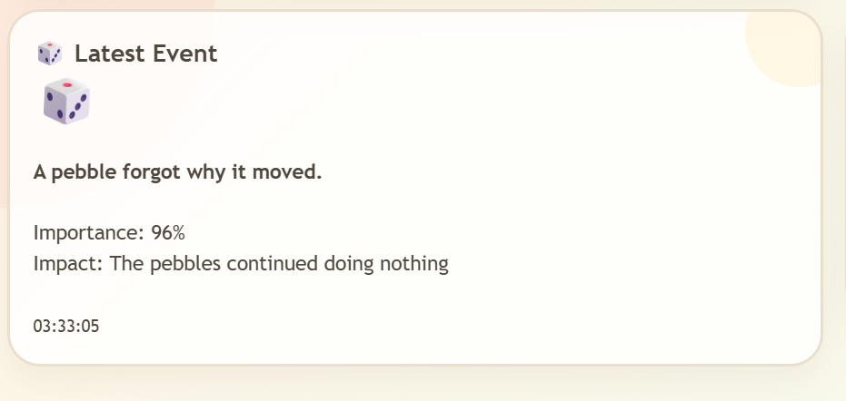
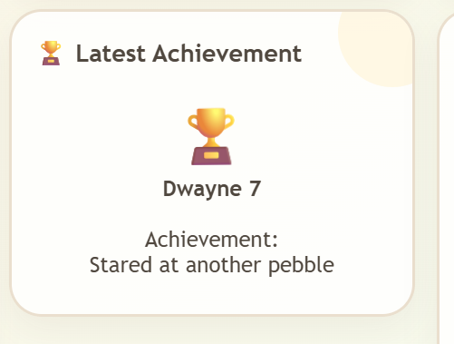
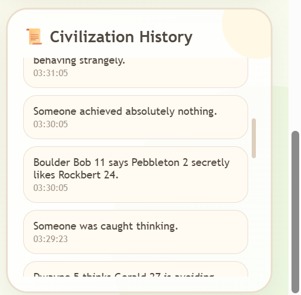

🪨 PEBBLEVERSE
A Civilization With Absolutely No Purpose.
PEBBLEVERSE is a humorous interactive civilization simulator where 30 completely ordinary pebbles somehow manage to have personalities, relationships, marriages, gossip, crimes, laws, government, an economy, achievements, and historical events — despite having absolutely no purpose.

🌍 Overview
PEBBLEVERSE is a lightweight Flask-based web simulation that creates a continuously changing virtual civilization.

Each pebble has its own identity and state, including:

Name

Personality

Mood

Age

Favorite number

Current action

Gossip count

Money

Crime count

Relationship status

Marriage status

Achievement

Activity status

The simulation changes automatically while the application is running.

Core idea
What happens when a civilization has everything except a purpose?

✨ Features
🗺️ Pebble Plains
The main simulation world displays the pebble population with randomized positions and movement.

30 pebbles

Dynamic positions

Changing moods and actions

Clickable pebbles

Animated visual environment

🧍 Pebble Profiles
Selecting a pebble displays its current information such as personality, mood, age, money, partner, crimes, status, and life purpose.

🏛️ Government
The civilization randomly assigns:

President

Vice President

Minister of Nothing

Minister of Rolling

Minister of Gossip

📊 Civilization Statistics
Live statistics include:

Population

Moving pebbles

Pebbles doing nothing

Gossip

Crimes

Relationships

Marriages

Economy

Civilization progress

Purpose

🎯 Civilization Purpose
The civilization's official purpose is:

NONE

Progress remains intentionally negligible.

🏘️ Pebble Town Square
A visual social hub showing:

Current mood

Social drama

Purpose

Live activity

Civilization announcements

Animated pebble interactions

🗣️ Gossip System
Random gossip is generated using a speaker, target, optional third pebble, statement, reliability score, classification, and timestamp.

Gossip levels:

CONFIRMED

RUMOR

SUSPICIOUS

WILD SPECULATION

⚖️ Pebble Court
Random crimes are generated and assigned humorous verdicts.

Example crimes:

Illegal Rolling

Suspicious Standing

Unauthorized Staring

Excessive Doing Nothing

Gossip Without Permission

Moving Without Purpose

Thinking Too Loudly

Being Suspicious

📜 Useless Laws
The civilization contains intentionally meaningless laws, for example:

Every pebble must stare at another pebble for 3 seconds.

Rolling more than 5 centimeters requires government permission.

Thinking about moving without actually moving is encouraged.

Gossip must be completely unreliable.

Nobody is allowed to accomplish anything.

💕 Relationships
Pebbles can randomly become:

Friends

Best Friends

Enemies

Suspicious Partners

Secret Friends

Professional Rivals

💍 Marriages
Unmarried pebbles can be paired randomly and married for absolutely no reason.

🎲 Random Events
The application continuously creates events such as:

A suspicious amount of nothing happened.

Someone looked at someone else.

A pebble rolled for absolutely no reason.

Nobody knows what happened.

A pebble forgot why it moved.

Someone was caught thinking.

Each event includes importance, impact, and timestamp.

🏆 Achievements
Pebbles can receive humorous achievements such as:

Moved 1 centimeter

Did absolutely nothing

Gossiped successfully

Survived another day

Avoided responsibility

Won an argument about nothing

🧩 Architecture
                 ┌─────────────────────┐
                 │     PEBBLEVERSE     │
                 │    Web Interface    │
                 └──────────┬──────────┘
                            │
                            ▼
                 ┌─────────────────────┐
                 │      Flask App      │
                 │       app.py        │
                 └──────────┬──────────┘
                            │
          ┌─────────────────┼─────────────────┐
          ▼                 ▼                 ▼
     Pebble State      Civilization      Simulation
        Data              Rules             Logic
          │                 │                 │
          ├───────┬─────────┼────────┬────────┤
          ▼       ▼         ▼        ▼        ▼
       Gossip   Court   Government  Social   Events
                                      │
                                      ▼
                              Relationships /
                                Marriages
          │
          └──────────────────┬────────────────┘
                             ▼
                    JSON API Responses
                             │
                             ▼
                     HTML / CSS / JS
                             │
                             ▼
                   Interactive Civilization
🔌 API Endpoints
Endpoint	Purpose
/	Loads the main interface
/pebbles	Returns and updates pebble states
/gossip	Generates and returns gossip
/event	Generates the latest event
/stats	Returns civilization statistics
/government	Returns government information
/laws	Returns civilization laws
/court	Generates and returns court cases
/relationships	Returns relationships
/marriages	Returns marriages
/achievement	Generates an achievement
/history	Returns recent civilization history
The frontend periodically requests these endpoints so the world changes without a page reload.

🔄 Update Cycle
Typical frontend update intervals:

Pebbles        → every 3 seconds
Statistics     → every 3 seconds
Gossip         → every 5 seconds
Court          → every 7 seconds
Relationships  → every 8 seconds
Events         → every 10 seconds
Marriages      → every 12 seconds
Achievements   → every 15 seconds
History        → every 10 seconds
This creates the impression of a continuously running civilization.

🎨 UI / UX
The interface intentionally uses a soft cartoon-world aesthetic rather than a conventional dashboard.

Design characteristics
Warm cream background

Rounded cards

Soft borders

Pebble illustrations

Emoji section indicators

Subtle shadows

Animated elements

Scrollable information panels

Responsive layout

Playful typography

Visual social interactions

The Town Square was added as a visual activity area to make the civilization feel more alive and reduce unused space in the main layout.

🖼️ Screenshots
Home / Pebble Plains

Pebble Profile

Government

Civilization Statistics

Civilization Purpose

Pebble Town Square

Gossip

Pebble Court

Useless Laws

Relationships

Marriages

Latest Event

Additional Views
Add the remaining screenshots to the repository and reference them here:

🎥 Demo Video
Recommended repository location:

assets/pebble.mp4
For a large video, it is better to host it externally or attach it to a GitHub Release rather than relying on a large binary directly in the repository.

Example:

## 🎥 Demo

[▶️ Watch the PEBBLEVERSE Demo](YOUR_DEMO_LINK)
🛠️ Technology Stack
Technology	Usage
Python	Backend and simulation logic
Flask	Web server and API
HTML5	Interface structure
CSS3	Styling and animations
JavaScript	Dynamic updates and interaction
JSON	API data exchange
Git	Version control
GitHub	Repository and collaboration
📁 Recommended Repository Structure
PEBBLEVERSE/
│
├── app.py
├── templates/
│   └── index.html
├── static/
│   ├── style.css
│   ├── script.js
│   └── images/
├── assets/
│   ├── Home.png
│   ├── pebble1.png
│   ├── pebble2.png
│   ├── pebble3.png
│   ├── pebble4.png
│   ├── pebble5.png
│   ├── pebble6.png
│   ├── pebble7.png
│   ├── pebble8.png
│   ├── pebble9.png
│   ├── pebble10.png
│   ├── pebble11.png
│   ├── pebble12.png
│   ├── pebble13.png
│   ├── pebble14.png
│   └── pebble.mp4
├── requirements.txt
└── README.md
Adjust this structure to match the actual source files in the final repository.

🚀 Installation
1. Clone the repository
git clone https://github.com/angeljosy/PEBBLEVERSE.git
cd PEBBLEVERSE
2. Create a virtual environment
Windows:

python -m venv venv
venv\Scripts\activate
macOS/Linux:

python3 -m venv venv
source venv/bin/activate
3. Install dependencies
pip install -r requirements.txt
If requirements.txt has not been created yet:

pip install flask
4. Run the application
python app.py
Open:

http://127.0.0.1:5000
🧪 Simulation Flow
Create 30 Pebbles
       ↓
Assign Random Properties
       ↓
Create Initial Relationships
       ↓
Create Initial Marriages
       ↓
Start Flask Server
       ↓
Frontend Requests Data
       ↓
Simulation Updates
       ├── Movement
       ├── Mood
       ├── Actions
       ├── Gossip
       ├── Crimes
       ├── Relationships
       ├── Marriages
       ├── Events
       └── Achievements
       ↓
Updated Civilization
💾 Data Model
A pebble is represented internally using a Python dictionary similar to:

{
    "id": 1,
    "name": "Gerald 1",
    "personality": "Dramatic",
    "mood": "Happy",
    "action": "Rolling slightly",
    "age": 42,
    "favorite_number": 7,
    "x": 50,
    "y": 40,
    "gossip": 3,
    "money": 250,
    "crime_count": 1,
    "status": "Active",
    "partner": None,
    "achievement": None
}
The current implementation uses in-memory state, so restarting the Flask server resets the simulation.

🧑‍💻 GitHub Development Workflow
Recommended workflow for contributing changes:

Fork
  ↓
Clone
  ↓
Create Feature Branch
  ↓
Develop
  ↓
Test
  ↓
Commit
  ↓
Push
  ↓
Pull Request
  ↓
Review / Merge
Example:

git checkout -b ui-improvements

git add .

git commit -m "Improve PebbleVerse UI and animations"

git push -u origin ui-improvements
🐛 Current Design Considerations
In-memory state
Civilization data is currently stored in Python memory. Restarting the server creates a new civilization.

Randomized simulation
Many properties and events are randomized, so each run can produce a different civilization.

No purpose
This is intentional.

It is the project's central feature.

🔮 Future Improvements
Potential extensions include:

Persistent database storage

User accounts

Authentication

Larger interactive world

Custom pebble appearances

More advanced personalities

AI-generated gossip

Real-time pebble chat

Historical statistics

Government elections

Detailed economy

Civilization conflicts

Pebble houses and neighborhoods

Dynamic weather

Sound effects

Mobile optimization

Online multiplayer

🎯 Project Objectives
PEBBLEVERSE demonstrates practical concepts in:

Full-stack web development

Flask application development

REST-style API endpoints

Dynamic JavaScript updates

Randomized simulation

State management

Interactive UI design

CSS animation

Responsive web design

Git and GitHub collaboration

Creative software development

📌 Project Status
Status: 🟢 Active Development

Population: 30 Pebbles

Purpose: NONE

Progress: 0.0001%

Economic Growth: Absolutely none

Productivity: Questionable

🪨 Philosophy
PEBBLEVERSE follows one simple principle:

A civilization doesn't need a purpose to have problems.

It has government.

It has laws.

It has gossip.

It has crime.

It has relationships.

It has marriages.

It has an economy.

It has achievements.

And somehow...

It still accomplishes absolutely nothing.
👥 Contributors
Angel A J 
Anu P S

