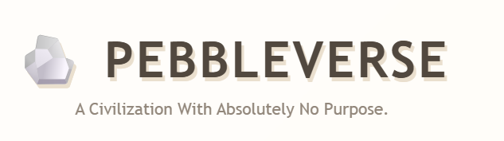

# 🪨 PEBBLEVERSE

## A Civilization With Absolutely No Purpose.

---

## Basic Details

### Team Name: Pebbleverse

### Team Members

- Team Lead: Angel A J - Sahrdaya College of Engineering and Technology
- Member 2: [Anu P S] - [Sahrdaya College of Engineering and Technology]

---

## Project Description

**PEBBLEVERSE** is a humorous real-time civilization simulator where 30 ordinary pebbles form a surprisingly complicated society.

They have a government, laws, gossip, crimes, court cases, relationships, marriages, money, achievements, and absolutely no useful purpose.

---

## The Problem (that doesn't exist)

The pebbles of the world are facing a serious crisis:

> **They have absolutely nothing to do.**

Without proper governance, laws, social relationships, unnecessary bureaucracy, or pointless activities, pebble civilization is dangerously close to becoming completely boring.

Someone had to solve this completely non-existent problem.

---

## The Solution (that nobody asked for)

Introducing **PEBBLEVERSE** — a fully simulated civilization for pebbles.

We give 30 pebbles:

- Personalities
- Moods
- Actions
- Money
- Government
- Laws
- Gossip
- Crimes
- Court cases
- Relationships
- Marriages
- Achievements
- Random events
- A constantly changing world

The result is a civilization where **something is always happening, even though nothing actually matters.**

---

# Technical Details

## Technologies/Components Used

### For Software:

- **Language:** Python
- **Backend:** Flask
- **Frontend:** HTML5, CSS3, JavaScript
- **Libraries:** Flask, Python Random, Datetime
- **Tools:** VS Code, Git, GitHub
- **Version Control:** GitHub

### For Hardware:

- No hardware components were required.
- PEBBLEVERSE is completely software-based.

---

# Implementation

## For Software

### Installation

Clone the repository:

```bash
git clone https://github.com/angeljosy/PEBBLEVERSE.git

Move into the project directory:

cd PEBBLEVERSE

Create a virtual environment:

python -m venv venv

Activate the virtual environment on Windows:

venv\Scripts\Activate.ps1

Install Flask:

pip install flask
Run

Start the Flask application:

python app.py

Open the following address in your browser:

http://127.0.0.1:5000/
Project Documentation
For Software
🖥️ Screenshots
1. PEBBLEVERSE Home

The main civilization dashboard showing the Pebble Plains and the current state of the pebble civilization.

2. Pebble Profile

An individual pebble profile showing its personality, mood, actions, and other characteristics.

3. Government

The completely unnecessary government of PEBBLEVERSE, including the President, Vice President, and various ministers.

4. Civilization Statistics

Real-time statistics showing population, movement, gossip, crimes, relationships, marriages, money, and civilization progress.

5. Civilization Purpose

The most important statistic in the entire civilization: Purpose = NONE.

6. Pebble Town Square

The social center where pebbles stand around, observe each other, gossip, and accomplish absolutely nothing.

7. Gossip System

Pebbles exchange completely unreliable information about one another.

8. Pebble Court

The civilization's legal system handles serious crimes such as suspicious standing and illegal rolling.

9. Useless Laws

Ridiculous laws created to regulate the completely unnecessary activities of pebble society.

10. Relationships

Pebbles form friendships, rivalries, secret friendships, and suspicious partnerships.

11. Marriages

Two pebbles can randomly get married for absolutely no reason.

12. Random Events

Random events continuously occur throughout the civilization.

13. Additional Civilization View

Another view of the dynamically changing PEBBLEVERSE dashboard.

14. Additional Civilization View

An additional view showing the interactive civilization interface.

15. Additional Civilization View

Another view of the PEBBLEVERSE simulation.

🔄 Workflow
                 ┌──────────────────────┐
                 │      PEBBLEVERSE     │
                 │    Flask Web App     │
                 └──────────┬───────────┘
                            │
                            ▼
                 ┌──────────────────────┐
                 │ Generate 30 Pebbles  │
                 └──────────┬───────────┘
                            │
                            ▼
                 ┌──────────────────────┐
                 │ Random Characteristics│
                 │                      │
                 │ • Personality        │
                 │ • Mood               │
                 │ • Action             │
                 │ • Age                │
                 │ • Money              │
                 │ • Position           │
                 └──────────┬───────────┘
                            │
                            ▼
                 ┌──────────────────────┐
                 │ Civilization Systems │
                 │                      │
                 │ Government           │
                 │ Laws                 │
                 │ Gossip               │
                 │ Court                │
                 │ Relationships        │
                 │ Marriages            │
                 │ Events               │
                 │ Achievements         │
                 └──────────┬───────────┘
                            │
                            ▼
                 ┌──────────────────────┐
                 │      REST APIs       │
                 └──────────┬───────────┘
                            │
                            ▼
                 ┌──────────────────────┐
                 │   Interactive UI     │
                 │   HTML / CSS / JS    │
                 └──────────┬───────────┘
                            │
                            ▼
                 ┌──────────────────────┐
                 │ Civilization Changes │
                 │     Continuously     │
                 └──────────────────────┘

PEBBLEVERSE continuously generates and updates a simulated civilization through Flask APIs and an interactive frontend.

🎥 Project Demo
Video

▶️ Watch the PEBBLEVERSE Demo

The demo showcases the interactive PEBBLEVERSE dashboard, pebble civilization, statistics, government, gossip, court, relationships, marriages, events, and other features.

🎲 What Makes It Useless?

PEBBLEVERSE intentionally solves a problem that does not exist.

Instead of optimizing:

Traffic
Healthcare
Finance
Agriculture
Business
Productivity

we optimized something much more important:

The completely unnecessary lives of 30 pebbles.

🏛️ Civilization Features
Feature	Description
🪨 Pebble Civilization	30 randomly generated pebbles
🧠 Personalities	Unique pebble personalities
😊 Moods	Continuously changing moods
🌎 Pebble Plains	Interactive civilization environment
🏛️ Government	President, Vice President and Ministers
📜 Laws	Completely unnecessary laws
🗣️ Gossip	Random and unreliable rumors
⚖️ Court	Pebble crimes and ridiculous verdicts
💕 Relationships	Friendships, enemies and rivals
💍 Marriages	Random pebble marriages
🎲 Events	Random civilization events
🏆 Achievements	Meaningless pebble achievements
📚 History	Continuous civilization history
💰 Economy	Random pebble money
🎯 Purpose	NONE
⚡ Real-Time Simulation

Different components of the civilization update automatically.

Feature	Update
Pebble movement	Every 3 seconds
Statistics	Every 3 seconds
Gossip	Every 5 seconds
Court	Every 7 seconds
Relationships	Every 8 seconds
Events	Every 10 seconds
History	Every 10 seconds
Marriages	Every 12 seconds
Achievements	Every 15 seconds

This creates a civilization that constantly changes while the application is running.

🧠 Randomness

The Python random module is used to generate:

Pebble characteristics
Positions
Moods
Actions
Government members
Relationships
Marriages
Gossip
Crimes
Events
Achievements

Therefore, every execution can produce a slightly different civilization.

🎯 Project Objective

The project demonstrates:

Flask web application development
REST API communication
Dynamic frontend updates
Python programming
Randomized simulation
State management
Interactive UI design
Event generation
Social relationship modeling
Creative software development
🔮 Future Scope

Future versions of PEBBLEVERSE could include:

Pebble families
Elections
Political parties
Jobs
Property ownership
Economic markets
Criminal investigations
AI-driven personalities
Pebble neighborhoods
Natural disasters
Civilization wars
Trading
Database persistence
Save/load civilization state
Multiplayer pebble civilization
👥 Team Contributions
Angel A J: Project concept, Flask backend, civilization simulation logic, pebble generation, government and laws, gossip system, court system, relationships, marriages, events, achievements.
Anu P S: [frontend integration, UI development, GitHub documentation and project integration.]

🪨 Final Result

PEBBLEVERSE successfully creates a dynamic civilization where:

30 Pebbles

↓

Government

↓

Laws

↓

Gossip

↓

Crime

↓

Court

↓

Relationships

↓

Marriage

↓

Events

↓

Absolutely No Purpose.
Made with ❤️ at TinkerHub Useless Projects


